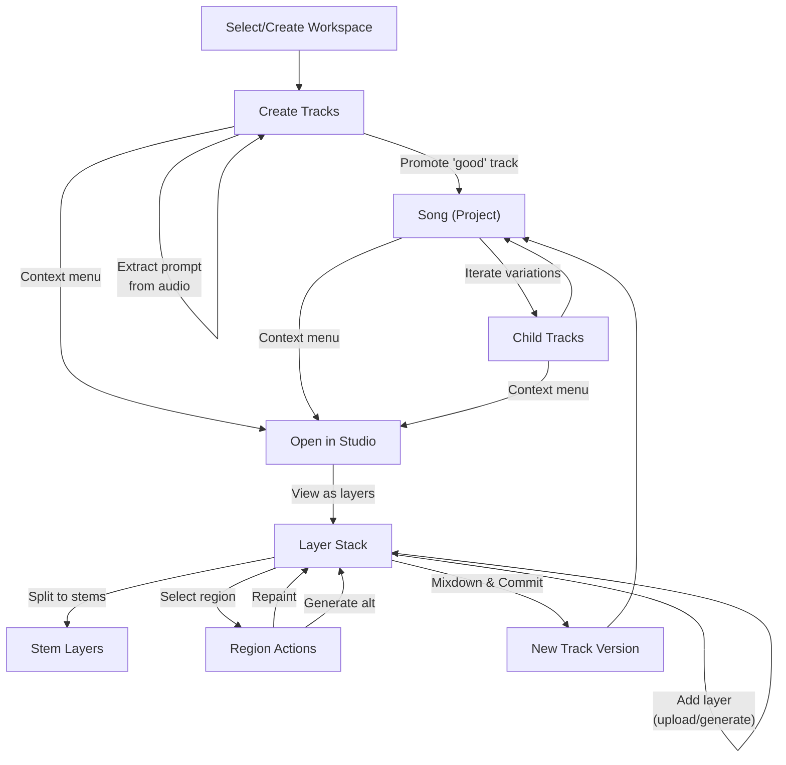
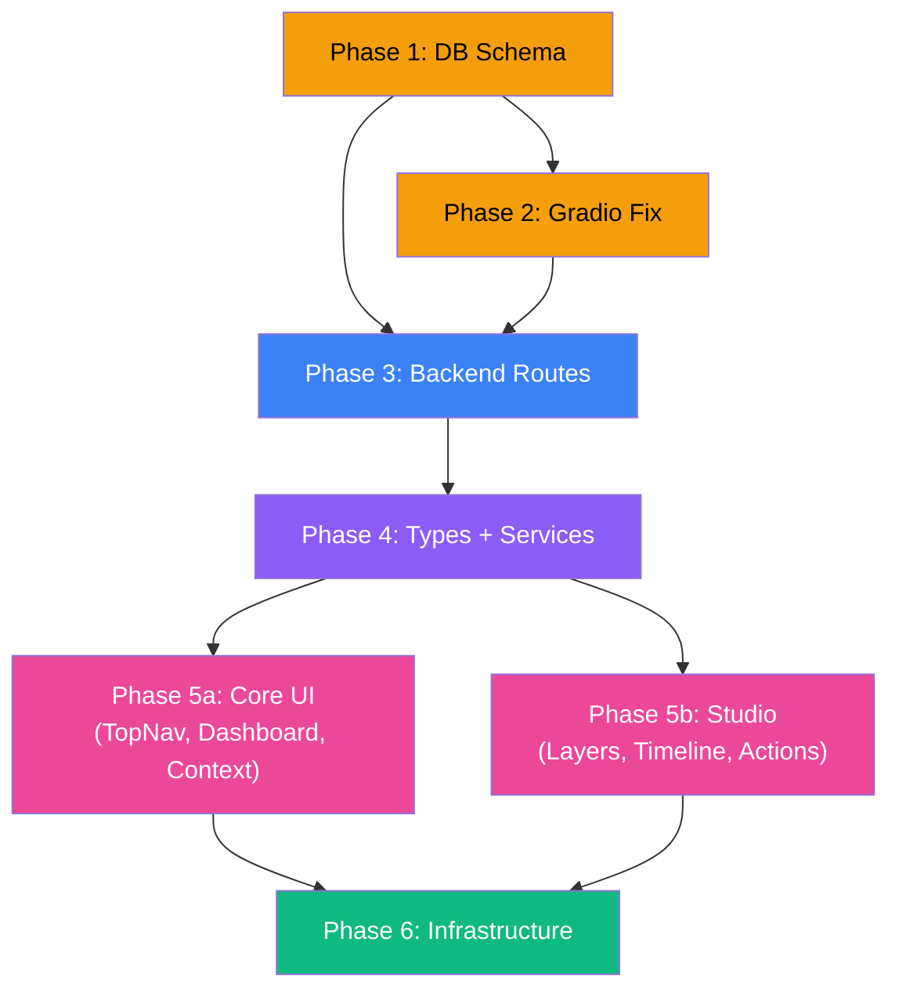

# ACE-Step-Up Studio: Architecture & Refactor Blueprint v2.2

## Resolved Decisions

| Question | Decision |
|----------|----------|
| AudioMass Integration | **Option A** — `<iframe>` with `postMessage` bridge |
| FFmpeg Mixdown | **Option A** — Shell out to system `ffmpeg` |
| Auth Replacement | **Option A** — Remove all auth/JWT completely |
| Video Generator | **Removed** — SaaS artifact |
| Data Migration | **Clean slate** — Drop all existing data |
| Tab Naming | **Generation** \| **Training** |
| Studio Access | Via track/song context menu only (not a breadcrumb level) |

---

## Navigation Model

### Top-Level Tabs

```
[Generation]  [Training]
```

### Dynamic Breadcrumb (Generation tab only)

The breadcrumb updates based on selection depth. Each segment is clickable to navigate back:

| Depth | Breadcrumb | What's Shown |
|-------|------------|-------------|
| 0 | `Generation` | Workspace selector (grid of workspaces) |
| 1 | `Generation > My Music` | Workspace contents: tracks + songs |
| 2 | `Generation > My Music > Summer Song` | Song detail: all iterations/child tracks |

> [!NOTE]
> The Studio is **not** a breadcrumb level. It is a fullscreen overlay accessed via a track's context menu → "Open in Studio". Closing the Studio returns the user to whatever breadcrumb depth they were at.

### Training Tab

No breadcrumb — just the training panel (LoRA fine-tuning).

---

## Creative Flow



### Workspace Organization

- **Tracks** live freely in a workspace — quick generations, experiments
- **Songs (Projects)** are promoted tracks — a curated "this is worth iterating on" signal
- Promoting a track to a Song creates a Project and links the track as the first child
- Further iterations from the Song create new child tracks under the same Project
- This keeps the workspace clean: casual experiments stay as loose tracks, serious work is grouped under Songs

#### Song Track Dropdown

Tracks that belong to a Song (Project) are displayed as a **collapsible dropdown** under that Song. The **most recent iteration** (or latest master) is the "top-level" playable entry — the user can quickly listen to the latest version without expanding:

```
┌──────────────────────────────────────────────────────┐
│ 🎼 Songs                                             │
│ ┌──────────────────────────────────────────────────┐ │
│ │ ▶ 🎼 Summer Song        (v3 • 3:24)    ⋯ [menu] │ │  ← plays latest
│ │  ▼ Iterations                                    │ │  ← expand
│ │   ├─ v3 (latest master)        3:24     ▶ ⋯     │ │
│ │   │  ├─ 🎸 Guitar     ▶                         │ │  ← stems
│ │   │  ├─ 🥁 Drums      ▶                         │ │
│ │   │  └─ 🎤 Vocals     ▶                         │ │
│ │   ├─ v2                        3:18     ▶ ⋯     │ │
│ │   └─ v1 (original)             3:20     ▶ ⋯     │ │
│ └──────────────────────────────────────────────────┘ │
└──────────────────────────────────────────────────────┘
```

- The play button on the Song row plays the **latest iteration** without needing to expand
- Each iteration's context menu (`⋯`) has the same actions as standalone tracks (Open in Studio, Split to Stems, etc.)
- If any iteration has stems, they appear as a nested dropdown under that iteration

### Stems as Dropdowns

When a track (anywhere — loose in workspace or inside a Song) has its stems generated, those stems appear as a **collapsible dropdown** underneath the track entry:

```
┌─────────────────────────────────────────────────┐
│ 🎵 Summer Vibes v2                    ⋯ [menu] │
│   ├─ 🎸 Guitar      [▶]  0:00 - 3:24          │
│   ├─ 🥁 Drums       [▶]  0:00 - 3:24          │
│   ├─ 🎤 Vocals      [▶]  0:00 - 3:24          │
│   └─ 🎹 Other       [▶]  0:00 - 3:24          │
├─────────────────────────────────────────────────┤
│ 🎵 Summer Vibes v1                    ⋯ [menu] │
│   (no stems)                                    │
└─────────────────────────────────────────────────┘
```

The context menu `⋯` on any track offers:
- ▶ Play
- ✏️ Open in Studio
- 🎼 Split to Stems (if no stems yet)
- ⬆️ Promote to Song (if not already in a song)
- 🔄 Create Variation
- 📋 Extract Prompt from Audio
- 🗑️ Delete

---

## Studio Architecture (Comprehensive Design)

The Studio is the centerpiece creative tool. It operates on a **non-destructive, layer-based editing model** — like Photoshop for audio.

### Studio Session Model

When a user opens a track or song in the Studio, a **session** is created (or resumed if one exists). The session persists across app restarts.

```
Studio Session
├── Source: Track or Song (Project)
├── Layer Stack (ordered top-to-bottom)
│   ├── Layer 1: "Master" (original track audio)
│   ├── Layer 2: "Vocals" (stem, locked original)
│   ├── Layer 3: "Drums" (stem, locked original)
│   ├── Layer 4: "Vocals - Repainted Section" (region 0:45-1:12)
│   ├── Layer 5: "Custom Synth" (uploaded .wav)
│   └── Layer 6: "AI Bass Line" (generated via prompt)
└── Mixdown History
    ├── v1 (committed 2024-01-15)
    └── v2 (committed 2024-01-16)
```

### Layer Types

| Type | Source | Can Delete? | Has Original? |
|------|--------|-------------|---------------|
| `master` | The loaded track's audio | No (can mute) | N/A — IS the original |
| `stem` | From stem separation (Demucs) | No (can mute) | Yes — always preserved |
| `upload` | User-uploaded .wav/.mp3 | Yes | N/A |
| `generated` | ACE-Step generation (prompt or a2a) | Yes | N/A |
| `repaint` | Region repaint of another layer | Yes | Parent layer preserved |

### Studio UI Layout

```
┌─────────────────────────────────────────────────────────────────────────┐
│ ← Back to [Workspace > Song]          STUDIO: "Summer Vibes v2"       │
├─────────┬───────────────────────────────────────────────────────┬──────┤
│ Layers  │                    Timeline                          │Tools │
│         │                                                      │      │
│ [+Add]  │  0:00    0:30    1:00    1:30    2:00    2:30  3:00 │      │
│         │  ┌──────────────────────────────────────────────┐    │ 🔧   │
│ 🔒 Master│  │▓▓▓▓▓▓▓▓▓▓▓▓▓▓▓▓▓▓▓▓▓▓▓▓▓▓▓▓▓▓▓▓▓▓▓▓▓▓▓▓▓▓│    │      │
│ 🔊 1.0  │  └──────────────────────────────────────────────┘    │Repaint│
│ M  S    │  ┌──────────────────────────────────────────────┐    │      │
│ 🔒Vocals│  │░░░░░░░░░░░░░░░░░░░░░░░░░░░░░░░░░░░░░░░░░░░░│    │Gen   │
│ 🔊 0.8  │  └──────────────────────────────────────────────┘    │Alt   │
│ M  S    │  ┌──────────────────────────────────────────────┐    │      │
│ 🔒Drums │  │▒▒▒▒▒▒▒▒▒▒▒▒▒▒▒▒▒▒▒▒▒▒▒▒▒▒▒▒▒▒▒▒▒▒▒▒▒▒▒▒▒▒│    │Split │
│ 🔊 1.0  │  └──────────────────────────────────────────────┘    │Stems │
│ M  S    │  ┌──────────────────────────────────────────────┐    │      │
│  Synth  │  │          ▓▓▓▓▓▓▓▓▓▓▓▓▓▓                    │    │Upload│
│ 🔊 0.6  │  └──────────────────────────────────────────────┘    │      │
│ M  S    │       ◄──[selected region]──►                        │      │
│         │                                                      │Mix   │
│         │  ▶ [Play] [Stop]  ⏪⏩  Loop: [On]                  │down  │
├─────────┴───────────────────────────────────────────────────────┴──────┤
│ Selection: 0:45 — 1:12 on "Vocals"    [Repaint] [Gen Alt] [Delete]   │
└─────────────────────────────────────────────────────────────────────────┘
```

**Legend:**
- `M` = Mute toggle, `S` = Solo toggle
- `🔒` = Locked layer (original stem/master — can't delete, can mute)
- `🔊 0.8` = Volume slider
- Timeline shows waveforms for each layer
- Selected region highlighted with handles

### Studio Actions & Workflows

#### A. Loading into Studio

**Input:** A Track (standalone or inside a Song)

1. Check if a `studio_session` exists for this track → resume it
2. If no session: create one
   - Add the track's `audio_url` as the `master` layer
   - If stems exist: add each stem as a `stem` layer (locked, with original preserved)
   - If no stems: only the `master` layer is shown
3. Render timeline with all layers as parallel waveforms

#### B. Region Selection

1. User clicks and drags on any layer's waveform → defines `selectionStart` and `selectionEnd` (in seconds)
2. The selected region is highlighted across all layers (vertical band)
3. A **Selection Action Bar** appears at the bottom:
   - **Repaint** — regenerate this region using ACE-Step
   - **Generate Alternative** — generate a new layer for just this region
   - **Freeze Region** — silence this region on the selected layer (non-destructive: the original audio is preserved and can be unfrozen; visually the region is dimmed to indicate it's frozen, not deleted)

#### C. Repaint Workflow

1. User selects a region on a layer (e.g., Vocals 0:45-1:12)
2. Clicks "Repaint"
3. A popover appears with:
   - Pre-filled prompt (from the track's original prompt)
   - Editable style/instruction
   - `repaintingStart` and `repaintingEnd` auto-filled from selection
   - Optional: upload reference audio for the repaint
4. On submit: calls ACE-Step with `taskType: 'repaint'`, `sourceAudioUrl: <layer_audio>`, `repaintingStart`, `repaintingEnd`
5. Result: a new `repaint` layer appears covering only the selected region
6. The original layer is untouched — the repaint layer overlays it
7. User can toggle visibility/mute to compare original vs repaint
8. Can repaint again to try alternatives (each creates a new layer)

#### D. Adding New Layers

The `[+ Add Layer]` button has two interaction modes:

**Default click** → Adds an **empty layer** immediately (named "New Layer"). The user can then populate it by:
- Dragging audio onto it
- Using the layer's context menu to upload, generate, or browse library

**Dropdown arrow (▼)** → Opens a menu with specific options:

| Option | Action |
|--------|--------|
| **Empty Layer** | Adds a blank layer (same as default click) |
| **From Library** | Opens a **library browser** panel. Browse order: ①Songs in current workspace (latest iteration) → ②Tracks in current workspace → ③Tracks from all workspaces. Select an audio file to add as a layer. |
| **Upload Audio** | File picker → user uploads .wav/.mp3/.flac → added as `upload` layer |
| **Generate from Prompt** | Opens mini-generation form: prompt + style + duration → calls ACE-Step `text2music` → result added as `generated` layer |
| **Generate from Audio** | Select a layer as source → audio2audio/cover generation → result added as `generated` layer |
| **Record** | (Future: microphone input — out of scope for v2.3) |

The **Library Browser** is a slide-out panel that shows:
```
┌─────────────────────────────┐
│ 📚 Select from Library      │
│ ─────────────────────────── │
│ 🎼 Songs (My Music)         │
│   ├─ Summer Song (v3)   ▶  │
│   └─ Night Drive (v1)   ▶  │
│ ─────────────────────────── │
│ 🎵 Tracks (My Music)        │
│   ├─ Lo-fi Sketch       ▶  │
│   └─ Beat Experiment    ▶  │
│ ─────────────────────────── │
│ 🌐 All Workspaces           │
│   ├─ Game SFX / Laser   ▶  │
│   └─ Game SFX / Boom     ▶  │
└─────────────────────────────┘
```

Generated layers can be:
- Full-duration (covers the entire timeline)
- Region-specific (covers only a selected region, if selection was active when generating)

#### E. Stem Splitting in Studio

1. User clicks "Split to Stems" in the Tools panel
2. Source: the `master` layer (or any selected full-duration layer)
3. **Analysis Phase**: The system first analyzes the audio to identify which instruments are present:
   - Calls a lightweight analysis endpoint (or Demucs pre-scan)
   - Returns a list of detected instrument classes with confidence scores
4. **Selection Modal** appears showing the analysis results:

```
┌──────────────────────────────────────────┐
│ 🎼 Stem Analysis: "Summer Vibes v2"      │
│ ──────────────────────────────────────── │
│ Detected instruments:                    │
│                                          │
│ ☑ 🎤 Vocals          (high confidence)  │
│ ☑ 🥁 Drums           (high confidence)  │
│ ☑ 🎸 Guitar          (medium confidence) │
│ ☑ 🎹 Piano/Keys      (medium confidence) │
│ ☐ 🎺 Brass           (low confidence)    │
│ ☑ 🎵 Bass            (high confidence)   │
│ ☐ 🔊 Other           (residual)          │
│                                          │
│ Pre-checked stems are recommended.       │
│ Uncheck any you don't need.              │
│                                          │
│            [Cancel]  [Generate Stems]    │
└──────────────────────────────────────────┘
```

5. User reviews, checks/unchecks desired stems, and clicks **"Generate Stems"**
6. Demucs processes the selected stem classes
7. Each selected stem is added as a `stem` layer (locked, original preserved)
8. The `master` layer is automatically muted (stems replace it)
9. Stems are also saved to the `stems` DB table for the parent track

> [!NOTE]
> If the analysis backend isn't available, fall back to the standard 4-stem split (Vocals, Drums, Bass, Other) with all pre-checked.

#### F. Layer Controls (per layer)

| Control | Behavior |
|---------|----------|
| **Volume Slider** | 0.0 → 1.0, affects mixdown |
| **Mute (M)** | Silences layer in playback and mixdown |
| **Solo (S)** | Only this layer plays (exclusive) |
| **Lock (🔒)** | Prevents deletion. Auto-set for `master` and `stem` layers |
| **Swap Audio** | Replace this layer's audio with an uploaded file (only for unlocked layers) |
| **Duplicate** | Copy layer → creates editable duplicate |
| **Delete** | Remove layer (only for unlocked layers) |
| **Revert to Original** | For `stem` layers: discard all repaint overlays, restore original audio |

#### G. Mixdown & Commit

1. User clicks "Mixdown" in the Tools panel
2. A **Mixdown Modal** opens showing all layers with selection controls:

```
┌──────────────────────────────────────────────────┐
│ 🎛️ Mixdown: "Summer Vibes v2"                    │
│ ──────────────────────────────────────────────── │
│ Select layers to include in the mix:             │
│                                                   │
│ ☐ 🔒 Master         🔊 ████████░░ 1.0   (muted) │
│ ☑ 🔒 Vocals         🔊 ██████░░░░ 0.8           │
│ ☑ 🔒 Drums          🔊 ████████░░ 1.0           │
│ ☑    Guitar (AI)    🔊 ██████░░░░ 0.7           │
│ ☑    Synth Pad      🔊 ████░░░░░░ 0.4           │
│ ☐    Vocal Repaint  🔊 ████████░░ 1.0           │
│                                                   │
│ Volume sliders are adjustable in this view.       │
│ Muted layers are unchecked by default.            │
│                                                   │
│ Save as:                                          │
│ ○ New Track (in workspace/song)                  │
│ ○ New Version (child of current track)           │
│ ○ Replace current track (destructive)            │
│                                                   │
│ Track name: [Summer Vibes v2 - Mix    ]          │
│                                                   │
│              [Cancel]  [Mixdown & Save]           │
└──────────────────────────────────────────────────┘
```

3. User selects which layers to include, adjusts per-layer volumes, chooses save mode
4. On confirm: calls backend `POST /api/studio/sessions/:id/mixdown`:
   - Sends selected layer IDs and their volumes
   - Uses `ffmpeg -filter_complex amix` to sum selected layers
   - Region layers are placed at their correct timeline offset
5. Result: a new audio file saved according to the chosen mode
6. The Studio session remains open for further editing

#### H. Session Persistence

- Studio sessions auto-save on every action (layer add/remove/edit, volume change, etc.)
- Sessions survive page refresh and app restart
- A session can be explicitly closed ("Close Session") which prompts for unsaved mixdown
- Sessions are linked to their source track — reopening the same track in Studio resumes the session

---

## Database Schema

### [MODIFY] [migrate.ts](file:///c:/Users/Lakshmi/source/repos/ace-step-up/server/src/db/migrate.ts)

```sql
-- Drop legacy SaaS tables
DROP TABLE IF EXISTS playlist_songs;
DROP TABLE IF EXISTS playlists;
DROP TABLE IF EXISTS liked_songs;
DROP TABLE IF EXISTS comments;
DROP TABLE IF EXISTS followers;
DROP TABLE IF EXISTS contact_submissions;
DROP TABLE IF EXISTS generation_jobs;
DROP TABLE IF EXISTS reference_tracks;
DROP TABLE IF EXISTS songs;
DROP TABLE IF EXISTS users;

-- Workspaces
CREATE TABLE IF NOT EXISTS workspaces (
  id TEXT PRIMARY KEY,
  name TEXT NOT NULL,
  type TEXT DEFAULT 'General',
  created_at TEXT DEFAULT (datetime('now')),
  updated_at TEXT DEFAULT (datetime('now'))
);

-- Projects (a "Song" — promoted from a track)
CREATE TABLE IF NOT EXISTS projects (
  id TEXT PRIMARY KEY,
  workspace_id TEXT NOT NULL REFERENCES workspaces(id) ON DELETE CASCADE,
  name TEXT NOT NULL,
  created_at TEXT DEFAULT (datetime('now')),
  updated_at TEXT DEFAULT (datetime('now'))
);

-- Tracks
CREATE TABLE IF NOT EXISTS tracks (
  id TEXT PRIMARY KEY,
  workspace_id TEXT REFERENCES workspaces(id) ON DELETE SET NULL,
  project_id TEXT REFERENCES projects(id) ON DELETE SET NULL,
  parent_track_id TEXT REFERENCES tracks(id) ON DELETE SET NULL,
  title TEXT NOT NULL,
  audio_url TEXT,
  task_type TEXT DEFAULT 'text2music',
  prompt TEXT,
  lyrics TEXT,
  style TEXT,
  duration INTEGER,
  bpm INTEGER,
  key_scale TEXT,
  time_signature TEXT,
  parameters TEXT DEFAULT '{}',
  seed INTEGER,
  cover_url TEXT,
  tags TEXT DEFAULT '[]',
  created_at TEXT DEFAULT (datetime('now')),
  updated_at TEXT DEFAULT (datetime('now'))
);

-- Stems (instrument-separated audio from a track)
CREATE TABLE IF NOT EXISTS stems (
  id TEXT PRIMARY KEY,
  track_id TEXT NOT NULL REFERENCES tracks(id) ON DELETE CASCADE,
  instrument_class TEXT NOT NULL,
  audio_url TEXT NOT NULL,
  is_custom INTEGER DEFAULT 0,
  created_at TEXT DEFAULT (datetime('now'))
);

-- Studio Sessions (persistent DAW sessions)
CREATE TABLE IF NOT EXISTS studio_sessions (
  id TEXT PRIMARY KEY,
  track_id TEXT NOT NULL REFERENCES tracks(id) ON DELETE CASCADE,
  name TEXT,
  is_active INTEGER DEFAULT 1,
  created_at TEXT DEFAULT (datetime('now')),
  updated_at TEXT DEFAULT (datetime('now'))
);

-- Studio Layers (audio layers within a session)
CREATE TABLE IF NOT EXISTS studio_layers (
  id TEXT PRIMARY KEY,
  session_id TEXT NOT NULL REFERENCES studio_sessions(id) ON DELETE CASCADE,
  stem_id TEXT REFERENCES stems(id) ON DELETE SET NULL,
  parent_layer_id TEXT REFERENCES studio_layers(id) ON DELETE SET NULL,
  source_type TEXT NOT NULL CHECK(source_type IN ('master', 'stem', 'upload', 'generated', 'repaint')),
  name TEXT NOT NULL,
  audio_url TEXT NOT NULL,
  original_audio_url TEXT,
  volume REAL DEFAULT 1.0,
  is_muted INTEGER DEFAULT 0,
  is_solo INTEGER DEFAULT 0,
  is_locked INTEGER DEFAULT 0,
  sort_order INTEGER DEFAULT 0,
  region_start REAL,
  region_end REAL,
  generation_params TEXT,
  created_at TEXT DEFAULT (datetime('now'))
);

-- Generation jobs
CREATE TABLE IF NOT EXISTS generation_jobs (
  id TEXT PRIMARY KEY,
  track_id TEXT REFERENCES tracks(id) ON DELETE SET NULL,
  status TEXT DEFAULT 'pending',
  params TEXT,
  result TEXT,
  error TEXT,
  created_at TEXT DEFAULT (datetime('now')),
  updated_at TEXT DEFAULT (datetime('now'))
);

-- Reference tracks
CREATE TABLE IF NOT EXISTS reference_tracks (
  id TEXT PRIMARY KEY,
  workspace_id TEXT REFERENCES workspaces(id) ON DELETE SET NULL,
  filename TEXT NOT NULL,
  storage_key TEXT NOT NULL,
  duration INTEGER,
  file_size_bytes INTEGER,
  tags TEXT DEFAULT '[]',
  created_at TEXT DEFAULT (datetime('now'))
);

-- Indexes
CREATE INDEX IF NOT EXISTS idx_projects_workspace ON projects(workspace_id);
CREATE INDEX IF NOT EXISTS idx_tracks_workspace ON tracks(workspace_id);
CREATE INDEX IF NOT EXISTS idx_tracks_project ON tracks(project_id);
CREATE INDEX IF NOT EXISTS idx_tracks_parent ON tracks(parent_track_id);
CREATE INDEX IF NOT EXISTS idx_tracks_created ON tracks(created_at);
CREATE INDEX IF NOT EXISTS idx_stems_track ON stems(track_id);
CREATE INDEX IF NOT EXISTS idx_studio_sessions_track ON studio_sessions(track_id);
CREATE INDEX IF NOT EXISTS idx_studio_layers_session ON studio_layers(session_id);
CREATE INDEX IF NOT EXISTS idx_studio_layers_sort ON studio_layers(session_id, sort_order);
CREATE INDEX IF NOT EXISTS idx_generation_jobs_status ON generation_jobs(status);
CREATE INDEX IF NOT EXISTS idx_reference_tracks_workspace ON reference_tracks(workspace_id);

-- Default workspace
INSERT OR IGNORE INTO workspaces (id, name, type)
VALUES ('default', 'My Music', 'General');
```

### [MODIFY] [pool.ts](file:///c:/Users/Lakshmi/source/repos/ace-step-up/server/src/db/pool.ts)

Update `tablesNeedingId`: remove `users`, add `workspaces`, `projects`, `tracks`, `stems`, `studio_sessions`, `studio_layers`.

---

## Backend API

### Phase 2: Gradio Bridge Fix

#### [MODIFY] [acestep.ts](file:///c:/Users/Lakshmi/source/repos/ace-step-up/server/src/services/acestep.ts)

Same fixes as v2.1:
- `prepareAudioFile()` → use `handle_file(absolutePath)` directly
- Force `--audio-cover-strength` when `referenceAudioUrl` present
- Pass `ditModel` / `lmModel` to Python fallback
- Add `sanitizeGradioPayload()` function

#### [MODIFY] [config/index.ts](file:///c:/Users/Lakshmi/source/repos/ace-step-up/server/src/config/index.ts)

Remove `jwt`, `pexels`. Add `python.path`.

#### [MODIFY] [.env.example](file:///c:/Users/Lakshmi/source/repos/ace-step-up/.env.example)

Remove JWT/Pexels, add `ACESTEP_PATH`, `PYTHON_PATH`.

### Phase 3: Backend Routes

#### Files to DELETE:

| File | Reason |
|------|--------|
| [routes/auth.ts](file:///c:/Users/Lakshmi/source/repos/ace-step-up/server/src/routes/auth.ts) | SaaS |
| [routes/users.ts](file:///c:/Users/Lakshmi/source/repos/ace-step-up/server/src/routes/users.ts) | SaaS |
| [routes/contact.ts](file:///c:/Users/Lakshmi/source/repos/ace-step-up/server/src/routes/contact.ts) | SaaS |
| [routes/playlists.ts](file:///c:/Users/Lakshmi/source/repos/ace-step-up/server/src/routes/playlists.ts) | SaaS |
| [routes/songs.ts](file:///c:/Users/Lakshmi/source/repos/ace-step-up/server/src/routes/songs.ts) | Replaced by tracks |
| [services/cleanup.ts](file:///c:/Users/Lakshmi/source/repos/ace-step-up/server/src/services/cleanup.ts) | SaaS cron |

#### [MODIFY] [middleware/auth.ts](file:///c:/Users/Lakshmi/source/repos/ace-step-up/server/src/middleware/auth.ts)

No-op passthrough: `req.user = { id: 'local-user' }; next();`

#### [NEW] `server/src/routes/workspaces.ts`

```
GET    /api/workspaces
POST   /api/workspaces            { name, type }
PATCH  /api/workspaces/:id        { name?, type? }
DELETE /api/workspaces/:id        (cascade)
```

#### [NEW] `server/src/routes/projects.ts`

```
GET    /api/workspaces/:wsId/projects
POST   /api/workspaces/:wsId/projects    { name }
POST   /api/tracks/:trackId/promote      (creates project, links track)
PATCH  /api/projects/:id                 { name? }
DELETE /api/projects/:id                 (cascade)
```

#### [NEW] `server/src/routes/tracks.ts`

```
GET    /api/tracks                        (filter: workspace_id, project_id, parent_track_id)
GET    /api/tracks/:id                    (includes stems + children)
POST   /api/tracks                        { workspace_id, project_id?, ... }
PATCH  /api/tracks/:id
DELETE /api/tracks/:id                    (cascade stems)
POST   /api/tracks/:id/iterate            (variation — sets parent_track_id)
POST   /api/tracks/:id/extract-prompt     (calls Gradio to analyze audio)
POST   /api/tracks/:id/split-stems        (calls Demucs → creates stems)
```

#### [NEW] `server/src/routes/stems.ts`

```
GET    /api/tracks/:trackId/stems
POST   /api/tracks/:trackId/stems         (add from upload or Demucs)
PATCH  /api/stems/:id                     (swap audio)
DELETE /api/stems/:id
```

#### [NEW] `server/src/routes/studio.ts`

The Studio has its own comprehensive route set:

```
# Session management
GET    /api/studio/sessions/:trackId      — Get or create session for a track
POST   /api/studio/sessions               { track_id } — Explicitly create session
DELETE /api/studio/sessions/:id           — Close/delete session

# Layer management
GET    /api/studio/sessions/:sid/layers   — List all layers (ordered by sort_order)
POST   /api/studio/sessions/:sid/layers   — Add layer
         Body: { source_type, name, audio_url?, stem_id?, region_start?, region_end? }
         For uploads: multipart form with audio file
         For generated: { source_type: 'generated', generation_params: {...} }
PATCH  /api/studio/layers/:id             — Update layer (volume, mute, solo, sort_order, name)
DELETE /api/studio/layers/:id             — Remove layer (rejects if is_locked)

# Layer actions
POST   /api/studio/layers/:id/repaint     — Repaint a region on this layer
         Body: { region_start, region_end, prompt?, style?, instruction? }
         → Creates a new 'repaint' layer with parent_layer_id
POST   /api/studio/layers/:id/generate    — Generate new content for this layer
         Body: { task_type, prompt?, source_audio_url?, ... }
         → Creates a new 'generated' layer
POST   /api/studio/layers/:id/revert      — Revert to original (for stem layers)
         → Removes all repaint children, restores original_audio_url

# Mixdown
POST   /api/studio/sessions/:sid/mixdown  — Mix all non-muted layers
         Body: { save_as: 'new_track' | 'new_version' | 'replace', name? }
         → FFmpeg amix → creates new track or updates existing

# Playback preview
GET    /api/studio/sessions/:sid/preview  — Generate a quick preview mix (lower quality)
```

#### [MODIFY] [routes/generate.ts](file:///c:/Users/Lakshmi/source/repos/ace-step-up/server/src/routes/generate.ts)

- Remove auth requirement
- Auto-create `tracks` row on successful generation
- Accept `workspace_id`, `project_id`, `parent_track_id`
- Support Studio-initiated generation (returns layer-compatible result)

#### [MODIFY] [index.ts](file:///c:/Users/Lakshmi/source/repos/ace-step-up/server/src/index.ts)

**Remove:** auth, users, contact, playlists, songs routes. Remove oEmbed, social bot handler, Pexels proxy, search endpoint, cleanup cron.

**Add:** workspaces, projects, tracks, stems, studio routes.

---

## Frontend Architecture

### Phase 4: Types & Services

#### [MODIFY] [types.ts](file:///c:/Users/Lakshmi/source/repos/ace-step-up/types.ts)

```typescript
// === Data Models ===

export interface Workspace {
  id: string;
  name: string;
  type: string;
  trackCount?: number;
  created_at: string;
}

export interface Project {  // A "Song"
  id: string;
  workspace_id: string;
  name: string;
  tracks?: Track[];
  created_at: string;
}

export interface Track {
  id: string;
  workspace_id?: string;
  project_id?: string;
  parent_track_id?: string;
  title: string;
  audio_url?: string;
  task_type: string;
  prompt?: string;
  lyrics?: string;
  style?: string;
  duration?: number;
  bpm?: number;
  key_scale?: string;
  time_signature?: string;
  parameters?: GenerationParams;
  seed?: number;
  cover_url?: string;
  tags: string[];
  stems?: Stem[];
  children?: Track[];
  has_stems?: boolean;      // quick check without loading stems
  isGenerating?: boolean;
  progress?: number;
  stage?: string;
  created_at: string;
}

export interface Stem {
  id: string;
  track_id: string;
  instrument_class: string;  // 'vocals' | 'drums' | 'bass' | 'other' | custom
  audio_url: string;
  is_custom: boolean;
  created_at: string;
}

// === Studio ===

export interface StudioSession {
  id: string;
  track_id: string;
  name?: string;
  is_active: boolean;
  layers: StudioLayer[];
  created_at: string;
}

export type LayerSourceType = 'master' | 'stem' | 'upload' | 'generated' | 'repaint';

export interface StudioLayer {
  id: string;
  session_id: string;
  stem_id?: string;
  parent_layer_id?: string;
  source_type: LayerSourceType;
  name: string;
  audio_url: string;
  original_audio_url?: string;
  volume: number;
  is_muted: boolean;
  is_solo: boolean;
  is_locked: boolean;
  sort_order: number;
  region_start?: number;    // null = full duration
  region_end?: number;
  generation_params?: Partial<GenerationParams>;
  created_at: string;
}

// === Navigation ===

export type TopView = 'generation' | 'training';

export type BreadcrumbLevel =
  | { level: 'root' }
  | { level: 'workspace'; workspace: Workspace }
  | { level: 'song'; workspace: Workspace; project: Project };

// GenerationParams stays as-is (already well-defined)
```

#### [MODIFY] [services/api.ts](file:///c:/Users/Lakshmi/source/repos/ace-step-up/services/api.ts)

Remove all SaaS APIs. Add `workspacesApi`, `projectsApi`, `tracksApi`, `stemsApi`, `studioApi`, `mixdownApi`.

The `studioApi` is the most significant addition:

```typescript
export const studioApi = {
  // Session
  getOrCreateSession: (trackId: string) =>
    api<StudioSession>(`/api/studio/sessions/${trackId}`),
  deleteSession: (sessionId: string) =>
    api<void>(`/api/studio/sessions/${sessionId}`, { method: 'DELETE' }),

  // Layers
  getLayers: (sessionId: string) =>
    api<StudioLayer[]>(`/api/studio/sessions/${sessionId}/layers`),
  addLayer: (sessionId: string, data: Partial<StudioLayer>) =>
    api<StudioLayer>(`/api/studio/sessions/${sessionId}/layers`, { method: 'POST', body: data }),
  updateLayer: (layerId: string, data: Partial<StudioLayer>) =>
    api<StudioLayer>(`/api/studio/layers/${layerId}`, { method: 'PATCH', body: data }),
  deleteLayer: (layerId: string) =>
    api<void>(`/api/studio/layers/${layerId}`, { method: 'DELETE' }),

  // Actions
  repaintRegion: (layerId: string, params: RepaintParams) =>
    api<StudioLayer>(`/api/studio/layers/${layerId}/repaint`, { method: 'POST', body: params }),
  generateOnLayer: (layerId: string, params: GenerationParams) =>
    api<StudioLayer>(`/api/studio/layers/${layerId}/generate`, { method: 'POST', body: params }),
  revertLayer: (layerId: string) =>
    api<StudioLayer>(`/api/studio/layers/${layerId}/revert`, { method: 'POST' }),

  // Mixdown
  mixdown: (sessionId: string, saveAs: 'new_track' | 'new_version' | 'replace', name?: string) =>
    api<Track>(`/api/studio/sessions/${sessionId}/mixdown`, {
      method: 'POST', body: { save_as: saveAs, name }
    }),
};
```

#### [DELETE] [context/AuthContext.tsx](file:///c:/Users/Lakshmi/source/repos/ace-step-up/context/AuthContext.tsx)

#### [NEW] `context/WorkspaceContext.tsx`

```typescript
interface WorkspaceContextType {
  workspaces: Workspace[];
  activeWorkspace: Workspace | null;
  setActiveWorkspace: (ws: Workspace | null) => void;
  createWorkspace: (name: string, type: string) => Promise<Workspace>;
  deleteWorkspace: (id: string) => Promise<void>;

  breadcrumb: BreadcrumbLevel;
  navigateTo: (level: BreadcrumbLevel) => void;

  activeProject: Project | null;
  setActiveProject: (p: Project | null) => void;
}
```

#### [NEW] `context/StudioContext.tsx`

```typescript
interface StudioContextType {
  isOpen: boolean;
  session: StudioSession | null;
  layers: StudioLayer[];
  selectedRegion: { layerId: string; start: number; end: number } | null;

  openStudio: (track: Track) => Promise<void>;
  closeStudio: () => void;

  addLayer: (data: Partial<StudioLayer>) => Promise<void>;
  updateLayer: (layerId: string, data: Partial<StudioLayer>) => Promise<void>;
  deleteLayer: (layerId: string) => Promise<void>;
  reorderLayers: (layerIds: string[]) => Promise<void>;

  setSelectedRegion: (region: { layerId: string; start: number; end: number } | null) => void;
  repaintRegion: (params: RepaintParams) => Promise<void>;
  generateOnLayer: (layerId: string, params: GenerationParams) => Promise<void>;

  mixdown: (saveAs: 'new_track' | 'new_version' | 'replace', name?: string) => Promise<Track>;
}
```

---

### Phase 5: UI Components

#### Components to DELETE (16 files):

`UserProfile.tsx`, `EditProfileModal.tsx`, `UsernameModal.tsx`, `NewsPage.tsx`, `ShareModal.tsx`, `SearchPage.tsx`, `PlaylistDetail.tsx`, `PlaylistModals.tsx`, `SongProfile.tsx`, `SongDropdownMenu.tsx`, `VideoGeneratorModal.tsx`, `Sidebar.tsx`, `MobileDrawer.tsx`, `LibraryView.tsx`, `services/geminiService.ts`, `data/news.json`

#### [NEW] `components/TopNav.tsx`

```
┌──────────────────────────────────────────────────────────────────┐
│ 🎵 ACE-Step-Up    [Generation] [Training]       ⚙️ Settings 🌙 │
│ ─────────────────────────────────────────────────────────────── │
│ 📍 Generation  >  My Music  >  Summer Song                     │
└──────────────────────────────────────────────────────────────────┘
```

- Each breadcrumb segment clickable → navigates back to that depth
- No "Editor/Studio" breadcrumb — Studio is an overlay

#### [NEW] `components/Dashboard.tsx`

Renders different content based on breadcrumb depth:

**Depth 0 (`root`):** Workspace selector grid
```
┌─────────────┐  ┌─────────────┐  ┌─────────────┐
│ 🎵 My Music │  │ 🎮 Game SFX │  │ + New       │
│ 12 tracks   │  │ 3 tracks    │  │ Workspace   │
│ General     │  │ SFX         │  │             │
└─────────────┘  └─────────────┘  └─────────────┘
```

**Depth 1 (`workspace`):** Track + Song list with `[+ New Track]` button
```
┌──────────────────────────────────────────────────┐
│ 🎵 Songs                                         │
│ ┌──────────────────────────────────────────────┐ │
│ │ 🎼 Summer Song                      ⋯ [menu]│ │
│ │   ├─ v3 (latest)           3:24     ▶       │ │
│ │   ├─ v2                    3:18     ▶       │ │
│ │   └─ v1 (original)        3:20     ▶       │ │
│ └──────────────────────────────────────────────┘ │
│                                                   │
│ 🎵 Tracks                          [+ New Track] │
│ ┌──────────────────────────────────────────────┐ │
│ │ 🎵 Experimental Beat              ⋯ [menu]  │ │
│ │   ├─ 🎸 Guitar     ▶                        │ │
│ │   ├─ 🥁 Drums      ▶                        │ │
│ │   ├─ 🎤 Vocals     ▶                        │ │
│ │   └─ 🎹 Other      ▶                        │ │
│ ├──────────────────────────────────────────────┤ │
│ │ 🎵 Lo-fi Sketch                   ⋯ [menu]  │ │
│ │   (no stems)                                 │ │
│ └──────────────────────────────────────────────┘ │
└──────────────────────────────────────────────────┘
```

**Depth 2 (`song`):** Song detail showing all iterations

#### [NEW] `components/TrackContextMenu.tsx`

Right-click or `⋯` button on any track:

```
┌─────────────────────────┐
│ ▶ Play                  │
│ ✏️ Open in Studio       │  ← opens fullscreen Studio overlay
│ ─────────────────────── │
│ 🎼 Split to Stems       │  (if no stems yet)
│ ⬆️ Promote to Song      │  (if standalone track)
│ 🔄 Create Variation     │
│ 📋 Extract Prompt       │
│ ─────────────────────── │
│ ✏️ Rename               │
│ 🗑️ Delete               │
└─────────────────────────┘
```

#### [NEW] `components/Studio.tsx`

The fullscreen Studio overlay. This is a complex component broken into sub-components:

```
components/
  Studio/
    Studio.tsx              — Main container, manages overlay lifecycle
    StudioTimeline.tsx      — AudioMass iframe + postMessage bridge
    StudioLayerPanel.tsx    — Left panel: layer list with controls
    StudioToolsPanel.tsx    — Right panel: action buttons
    StudioActionBar.tsx     — Bottom bar: selection-based actions
    StudioAddLayerModal.tsx — Modal: upload / generate / a2a options
    StudioRepaintForm.tsx   — Popover: repaint parameters
    StudioMixdownDialog.tsx — Dialog: save-as options after mixdown
```

**Studio.tsx** (top-level):
- Renders as a fixed fullscreen overlay (`position: fixed; inset: 0; z-index: 100`)
- Header: "← Back to [breadcrumb context]" + session name
- Three-panel layout: Layers (left) | Timeline (center) | Tools (right)
- Action bar at bottom (appears on region selection)
- Wraps everything in `<StudioContext.Provider>`

**StudioTimeline.tsx:**
- Embeds AudioMass as an `<iframe src="/editor">`
- `postMessage` bridge API:
  - `loadAudio(layerId, audioUrl)` — loads a layer's audio into AudioMass
  - `getSelection()` → `{ start, end }` — get user's time selection
  - `onSelectionChange(callback)` — react to selection changes
  - `setRegionHighlight(start, end)` — highlight a repaint region
- When multiple layers: shows stacked waveforms (one AudioMass instance per layer, or a custom multi-track waveform renderer if AudioMass can't handle it)

**StudioLayerPanel.tsx:**
- Ordered list of layers with drag-to-reorder
- Per-layer: name, source badge, volume slider, M/S toggles, 🔒 indicator
- `[+ Add Layer]` button at top
- Layers grouped: locked/original at top, editable below

#### [MODIFY] `components/CreatePanel.tsx` → refactor into [NEW] `components/NewTrackModal.tsx`

Floating `[+ New Track]` button + modal with:
- Task type selector
- Source selection (prompt / audio file / cover / reference)
- Auto-detect reference → audio2audio
- "Extract Prompt" for imported audio
- Advanced params accordion

#### [MODIFY] `components/RightSidebar.tsx` → [NEW] `components/ContextSidebar.tsx`

Tabbed sidebar (visible in Dashboard, hidden in Studio):
- **Context Info** tab: metadata, generation params, seed for selected track
- **Quick Gen** tab: simple prompt + generate button (creates track in active workspace)

#### Components KEPT with modifications:

| Component | Changes |
|-----------|---------|
| `Player.tsx` | `Song` → `Track`, remove social actions |
| `TrainingPanel.tsx` | Kept as-is, under "Training" tab |
| `SettingsModal.tsx` | Remove profile/video sections |
| `AlbumCover.tsx` | `Song` → `Track` |
| `EditableSlider.tsx` | No changes |
| `ConfirmDialog.tsx` | No changes |
| `Toast.tsx` | No changes |

#### [MODIFY] [App.tsx](file:///c:/Users/Lakshmi/source/repos/ace-step-up/App.tsx)

```tsx
function App() {
  return (
    <I18nProvider>
      <ResponsiveProvider>
        <WorkspaceProvider>
          <StudioProvider>
            <AppContent />
          </StudioProvider>
        </WorkspaceProvider>
      </ResponsiveProvider>
    </I18nProvider>
  );
}

function AppContent() {
  const { breadcrumb } = useWorkspace();
  const { isOpen: studioOpen } = useStudio();
  const [topView, setTopView] = useState<TopView>('generation');
  const [selectedTrack, setSelectedTrack] = useState<Track | null>(null);

  return (
    <div className="app-container">
      <TopNav topView={topView} onChangeView={setTopView} />

      <main className="app-main">
        {topView === 'training' ? (
          <TrainingPanel />
        ) : (
          <div className="dashboard-layout">
            <Dashboard onSelectTrack={setSelectedTrack} />
            <ContextSidebar selectedTrack={selectedTrack} />
          </div>
        )}
      </main>

      <Player />

      {/* Studio overlays everything when open */}
      {studioOpen && <Studio />}
    </div>
  );
}
```

---

### Phase 6: Infrastructure

#### [MODIFY] [vite.config.ts](file:///c:/Users/Lakshmi/source/repos/ace-step-up/vite.config.ts)

Remove `/blog` proxy, remove `GEMINI_API_KEY` define.

#### [MODIFY] [server/package.json](file:///c:/Users/Lakshmi/source/repos/ace-step-up/server/package.json)

Remove `jsonwebtoken`, `@types/jsonwebtoken`.

#### [MODIFY] [package.json](file:///c:/Users/Lakshmi/source/repos/ace-step-up/package.json)

Remove `@google/genai`.

#### [MODIFY] startup scripts

Add `gradio_app.py` launch option, Python path detection.

#### [MODIFY] [index.html](file:///c:/Users/Lakshmi/source/repos/ace-step-up/index.html)

Update title/meta tags.

---

## Execution Order



Phase 5 splits into **5a** (core navigation/dashboard) and **5b** (Studio) which can be developed in parallel.

---

## File Impact Summary

| Category | Count | Details |
|----------|-------|---------|
| **Files to DELETE** | **22** | 16 frontend + 6 backend |
| **Files to CREATE** | **17** | 6 backend routes + 2 contexts + 9 frontend components |
| **Files to MODIFY** | **15** | DB, services, config, types, api, App.tsx, etc. |

---

## Verification Plan

### Phase 1-2
```bash
cd server && npm run db:migrate    # Clean schema
cd server && npm run dev           # No import errors
curl http://localhost:3001/health   # Health check
```

### Phase 3
```bash
# Workspace CRUD
curl -X POST localhost:3001/api/workspaces -H "Content-Type: application/json" -d '{"name":"Test"}'
# Track generation
curl -X POST localhost:3001/api/generate -H "Content-Type: application/json" -d '{"customMode":true,"style":"pop","workspace_id":"default"}'
# Studio session
curl localhost:3001/api/studio/sessions/<trackId>
```

### Phase 5
```bash
npm run build   # Frontend compiles
npm run dev     # Dev server starts
```

### Manual Flow
1. Open app → workspace selector → click "My Music"
2. Click `[+ New Track]` → generate → track appears with stems dropdown
3. Right-click track → "Promote to Song" → song appears in Songs section
4. Right-click track → "Open in Studio" → fullscreen overlay
5. Studio: see master + stem layers → select region → Repaint
6. Studio: `[+ Add Layer]` → Generate from Prompt → new layer appears
7. Studio: Mixdown → "Save as New Version" → new track in song
8. LAN access: `http://<LAN-IP>:3000`
